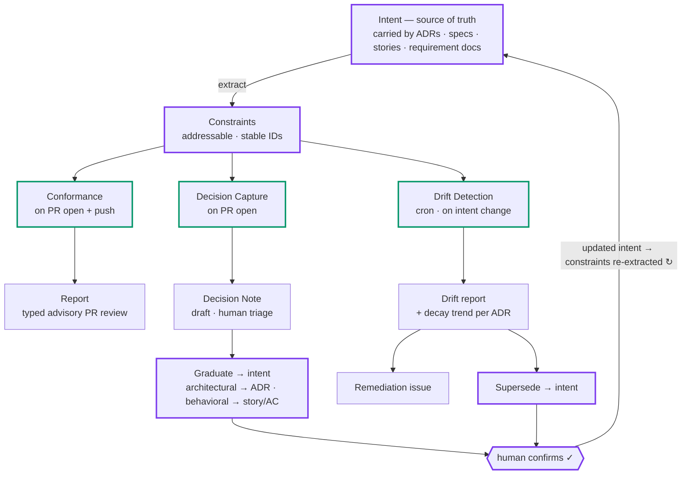

# 🛰️ Delivery Radar

**Intent–Implementation Alignment & Convergence (IIAC)** — a governance engine
that keeps code changes aligned with recorded intent (ADRs, specs, stories) and
makes intent and implementation *converge* over time instead of drifting apart
one green build at a time.

> AI writes code faster than anyone can review it against **why** the system is
> built the way it is. PRs pass every test and still quietly break decisions the
> team already made. Delivery Radar checks every change against the recorded
> decisions — and the business reasons behind them.

## The IIAC Loop



Three operations over one shared contract:

| Operation | Trigger | Output |
|---|---|---|
| **Conformance** — enforce | PR open + push | typed, advisory PR review with evidence (ADR clause ↔ code lines) |
| **Drift Detection** — audit | cron · intent change | drift report + decay trends; remediate-or-supersede drafts |
| **Decision Capture** — produce | PR open | Decision Notes for implicit decisions; graduate to new intent |

*Alignment makes each change right; convergence makes the trajectory settle —
no oscillation, deterministic output.*

**Auditability is part of the method, not garnish.** Convergence is a property
of a *trajectory*, and a trajectory needs memory: without recorded verdicts,
confirmations and intent history you can tell you're aligned *right now* — but
never whether you're *getting closer*. In AI-led development, where agents write most
of the code, the audit trail is the system's institutional memory: stable
constraint IDs make history addressable, recorded confirmations keep settled
questions settled, and the distance-from-intent trend becomes computable in the
first place. **No history, no trajectory; no trajectory, no convergence** — *who
decided, what changed, why*.

## Progress — the vision is big; today's slice is deliberately thin

Built in one hackathon day (2026-06-12). Every 🧭 row already carries stable
requirement IDs in [the spec](docs/requirements/delivery-radar-requirements.en.md)
— the vision is sequenced, not vapor.

| # | Capability | Spec | Status |
|---|---|---|---|
| 1 | Constraint extraction from ADR blocks | `FR-EXT-1/3` | ✅ **live** |
| 2 | Scope-first retrieval (noise control) | `NFR-RETRIEVAL-1` | ✅ **live** |
| 3 | Driver-grounded semantic conformance | `FR-CONF-3..6` | ✅ **live** |
| 4 | Advisory review on real PRs, evidence-linked | `FR-CONF-7..9` | ✅ **live** (structural comment type) |
| 5 | Verdict persistence & replay | `NFR-EVAL-1` (partial) | 🟡 basic (`--save` / `--replay`) |
| 6 | GitHub Action automation (auto-run on PR events) | `FR-INT-1` | 🔜 next |
| 7 | Decision Capture → Notes → graduation | `FR-CAP-1..9` | 🧭 specified |
| 8 | Drift engine + decay dashboard | `FR-DRIFT-0..8` | 🧭 specified (dashboard = seeded preview) |
| 9 | Behavioral intent layer (stories / AC) | §3.1 Phase 2 | 🧭 specified |
| 10 | Audit trail: verdicts + human signals persisted | `FR-CONF-10` `NFR-EVAL-1` | 🧭 specified |
| 11 | Historical-replay precision harness | §14 `AC-1/2` | 🧭 specified |
| 12 | Earned gating (deterministic + proven precision only) | `NFR-GATE-1` | 🧭 specified |
| 13 | Pre-PR self-check in agent loops → long-horizon autonomy | `FR-CONF-2` | 🧭 specified |

**4 of 13 capability groups run today.** That ratio is the point: the live
slice proves the differentiating mechanism (driver-grounded verdicts on real
PRs); the other nine are why it matters — see the
[showcase](https://fang-lin.github.io/GlobalHack-DeliveryRadar-pages/).

## Live demo

- **Demo PR with a real verdict**: [fang-lin/GlobalHack-shop-demo#1](https://github.com/fang-lin/GlobalHack-shop-demo/pull/1) —
  CI-green "bugfix" that violates ADR-001's business driver; the radar's advisory
  review quotes the recorded business rationale (EPIC-512, peak-sale stability)
  and the direction of the fix.
- **Showcase pages** (GitHub Pages):
  - 🛰️ [Slides — the IIAC showcase](https://fang-lin.github.io/GlobalHack-DeliveryRadar-pages/) (landing: loop · system map · three eras · roadmap)
  - 📊 [Dashboard — the architect's view](https://fang-lin.github.io/GlobalHack-DeliveryRadar-pages/dashboard.html) (live verdict in the conformance feed; drift/capture are Phase-2 previews)
  - ⚖️ [Contrast — grounded vs ungrounded](https://fang-lin.github.io/GlobalHack-DeliveryRadar-pages/contrast.html) (same model, same diff, with and without recorded intent)

## Quickstart

```bash
npm install && npm run build      # TypeScript → dist/; `radar` bin = dist/cli.js
echo "ANTHROPIC_API_KEY=sk-ant-..." > .env   # gitignored

# extract constraints from a repo's ADRs
radar extract --adr-dir ../shop-demo/docs/adr

# check a PR diff against in-scope constraints (semantic, driver-grounded)
gh pr diff 1 -R fang-lin/GlobalHack-shop-demo > pr1.diff
radar check --adr-dir ../shop-demo/docs/adr --diff pr1.diff --save verdicts.json

# project verdicts as an advisory PR review
radar comment --adr-dir ../shop-demo/docs/adr --verdicts verdicts.json \
  --repo fang-lin/GlobalHack-shop-demo --pr 1 --post
```

`radar` resolves via the `bin` entry once built (or `npm link` / a symlink to
`dist/cli.js`); during development use `npm run radar -- <args>` (tsx). Tests: `npm test` (vitest).

## Tech stack

TypeScript (Node 22) · `@anthropic-ai/sdk` with Zod-typed structured outputs
(`messages.parse` + `zodOutputFormat`) · `js-yaml` for ADR constraint blocks ·
`vitest` for tests. Semantic checks run on `claude-sonnet-4-6` with adaptive
thinking. Deterministic checks (Phase 2) will shell out to semgrep.

## Repository layout

```
src/              CLI + core (TypeScript): cli · extract · retrieve · diff · checker · comment · models(zod)
tests/            vitest tests + fixtures (ADR parsing, scope retrieval)
scripts/          baseline-review · make-contrast (tsx)
dashboard/        static demo pages (slides=index, dashboard, contrast)
artifacts/        persisted verdicts + baseline output (replayable)
docs/
  requirements/   full build spec (zh authoritative · en mirror)
  specs/          design specs — demo-day slice, IIAC Loop diagram (zh · en)
  governance/     documentation policy (bilingual, zh authoritative)
  video/          showcase operating scripts (zh · en)
  adr/            reserved for this repo's own ADRs (en)
```

Principles that never bend: **machine drafts, human confirms** · advisory by
default, a check earns the right to block · the constraint is the single shared
contract.

---

Built at the [Thoughtworks](https://www.thoughtworks.com) **Global Hackathon**
(June 2026), organized and sponsored by Thoughtworks. *Innovation that AI/works™*


