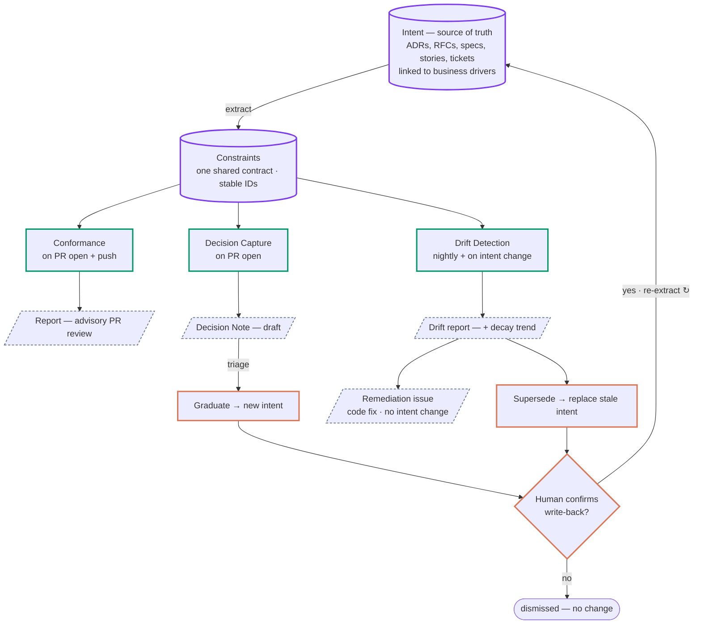

<div align="center">

# 🛰️ Delivery Radar

**Intent–Implementation Alignment & Convergence (IIAC)**
*Keep AI-written code true to **why** the system was built.*

<a href="https://www.thoughtworks.com"></a>


*Innovation that AI/works™*

</div>

---

When humans wrote the code, a colleague reviewing your PR could ask: *does this
still fit how we build things — and the reasons behind it?* In the AI era that
breaks. Code now arrives faster than anyone can review it against intent; PRs
pass every test and still quietly break decisions the team already made.
Pointing an agent at the PR to "vibe-review" it — eyeball the diff and hope —
isn't the answer; to review code, an agent needs a **method**.

Delivery Radar is that method: **Intent–Implementation Alignment & Convergence
(IIAC)**[^iiac]. It checks every change against the team's recorded decisions *and the
business reasons behind them*, and keeps intent and implementation converging
instead of drifting apart one green build at a time.

## 🎬 See it work

[`GlobalHack-shop-demo` PR #1](https://github.com/fang-lin/GlobalHack-shop-demo/pull/1)
is a textbook case: a well-meaning *"fix stale stock counts"* bugfix that
**passes every automated check (CI) green** — while quietly reintroducing a
database pattern the team had explicitly banned in an **ADR**[^adr]. Tests stay
silent. Linters stay silent. Here is
the review Delivery Radar posted on it (excerpt — [full comment on the PR](https://github.com/fang-lin/GlobalHack-shop-demo/pull/1)):

> 🔴 **VIOLATED** — Inventory reads tolerate eventual consistency · `ADR-001-C1` · severity **high** · confidence **0.99**
>
> **Why this rule exists** (driver `EPIC-512`): the business explicitly accepts stock counts up to five minutes stale, in exchange for conversion-critical page latency and primary-database stability during peak sales; checkout does the authoritative re-check at reservation time, so a stale product-page count never oversells.
>
> **Evidence:** `services/inventory/reader.py` L19–L23 — the diff removes the cache/replica read path and replaces it with a synchronous `SELECT … FOR UPDATE` on the primary (a row lock that serializes reads), the exact pattern ADR-001 prohibits.

It quotes the *reason*, points at the exact lines, and gives the direction of
the fix — as an **advisory** comment that never blocks the merge. (The
confidence is the model's own self-assessment, not a calibrated probability —
calibrating it is what the replay harness, capability #11, is for.)

Here's the crux: **the staleness wasn't a bug — the team *chose* it.** A generic
reviewer would try to "fix" it; Delivery Radar defends it. **Aligning to intent
is not the same as aligning to best practice** — and that gap is exactly what no
existing tool checks.

## ✨ Why this is new

| | checks | misses |
|---|---|---|
| Tests | *does it work?* | whether it still matches intent |
| Linters | *is it tidy?* | whether it still matches intent |
| Generic AI review | plausible opinions | the *recorded reason* — and may even propose its own violation |
| **Delivery Radar** | **the diff against recorded intent + its business driver**[^driver] | — |

We illustrate the gap with a representative case —
[the same model, same diff, with and without grounding](https://fang-lin.github.io/GlobalHack-DeliveryRadar-pages/#/evidence/example)[^grounding].
Ungrounded, the model treats the staleness as a bug to *fix* and even proposes
reading the primary directly — itself a violation of ADR-001. Review without a
method is opinion; grounded in intent, it becomes a **verdict**[^verdict] —
addressable, measurable, attached to the decision.

**And we measured that gap.** Across 7 cases built on
[Spotify Backstage's own published ADRs](https://github.com/backstage/backstage/tree/master/docs/architecture-decisions)
— real merged PRs and real code — the grounded checker scores **precision/recall/F1 = 1.00**,
while the *same model* ungrounded misses **3 of 4** intent-specific violations (recall **0.25**).
On one, the ungrounded reviewer even *argues for* a `node-fetch` import — unaware the team had
already decided (ADR014, superseding ADR013) to move to native `fetch`.
[See the measured evidence ›](https://fang-lin.github.io/GlobalHack-DeliveryRadar-pages/#/evidence)
(this is the replay harness, capability #11; a seeded corpus, so the numbers are illustrative —
`npm run eval` reproduces them).

> **Why it matters:** a senior engineer spends hours every week answering
> *"does this still fit our architecture?"* on pull requests — the bottleneck AI
> code generation makes worse, not better. Delivery Radar automates exactly that
> question, and turns decision documents from shelf-ware into active guardrails.

## 🔁 The IIAC Loop

**Read it as a flowchart, top-down — standard shapes carry the meaning:**
**cylinders** = data stores (Intent, Constraints) · **rectangles** = processes
(the three operations, plus graduate/supersede) · **parallelograms** = outputs ·
**diamond** = the human decision. Extract constraints from intent → the three
operations act on them → every write-back to intent passes the human gate.
*Each pass aligns one change; the loop drives convergence over time.*



Three operations over one shared contract — the constraint[^constraint]:

| Operation | Trigger | Output |
|---|---|---|
| **Conformance** — enforce | PR open + push | typed, advisory PR review with evidence (ADR clause ↔ code lines) |
| **Decision Capture** — produce | PR open | Decision Notes for decisions a PR makes implicitly; graduate to new intent |
| **Drift Detection** — audit | cron · intent change | drift report + decay trends; remediate-or-supersede drafts |

*Alignment makes each change right; convergence keeps the whole thing moving
closer to intent instead of drifting away.*

## 🛡️ Responsible & auditable by design

- **Machine drafts, human confirms** — every write-back to intent passes a human gate; nothing executes on its own.
- **Advisory by default; gating is earned** — a check may block a merge only once it is deterministic *and* its precision has been proven on the repo's own history. Semantic checks never block.
- **Built to be tracked** — verdicts are persisted today (`--save`/`--replay`); the design records every verdict, its evidence, and every human confirmation, with intent history in git, so you can always answer *who decided, what changed, why.* (Full audit trail is capability #10 — `🧭 specified`.) Convergence needs memory: you can't tell you're getting *closer* if you can't see where you've been.

## 📊 Progress — the vision is big; today's slice is deliberately thin

Every 🧭 row already carries stable requirement IDs in
[the spec](docs/requirements/delivery-radar-requirements.en.md) — the vision is
sequenced, not vapor.

| # | Capability | Spec | Status |
|---|---|---|---|
| 1 | Constraint extraction from ADR blocks | `FR-EXT-1/3` | ✅ **live** |
| 2 | Scope-first retrieval (noise control) | `NFR-RETRIEVAL-1` | ✅ **live** |
| 3 | Driver-grounded semantic conformance | `FR-CONF-3..6` | ✅ **live** |
| 4 | Advisory review on real PRs, evidence-linked | `FR-CONF-7..9` | ✅ **live** (structural comment type) |
| 5 | Verdict persistence & replay | `NFR-EVAL-1` (partial) | 🟡 basic (`--save` / `--replay`) |
| 6 | GitHub Action automation (auto-run on PR events) | `FR-INT-1` | 🔜 next |
| 7 | Decision Capture → Notes → graduation | `FR-CAP-1..9` | 🧭 specified |
| 8 | Drift engine + decay dashboard | `FR-DRIFT-0..8` | 🧭 specified (dashboard = seeded preview) |
| 9 | Behavioral intent layer (stories / AC) | §3.1 Phase 2 | 🧭 specified |
| 10 | Audit trail: verdicts + human signals persisted | `FR-CONF-10` `NFR-EVAL-1` | 🧭 specified |
| 11 | Historical-replay precision harness | §14 `AC-1/2` | 🟡 first results — grounded P/R/F1 = 1.00 vs ungrounded R = 0.25 on 7 real Backstage-ADR cases ([evidence](https://fang-lin.github.io/GlobalHack-DeliveryRadar-pages/#/evidence)) |
| 12 | Earned gating (deterministic + proven precision only) | `NFR-GATE-1` | 🧭 specified |
| 13 | Pre-PR self-check in agent loops → long-horizon autonomy | `FR-CONF-2` | 🧭 specified |

**4 of 13 capability groups run today.** That ratio is the point: the live slice
proves the differentiating mechanism (driver-grounded verdicts on real PRs); the
other nine are why it matters.

## 🚀 Where it's going

From **writing**, to **steering**, to **autonomy**. Humans used to write code and
review each other's. Today AI writes the code and humans steer in real time —
which scales to one person, one session. The aim: recorded, machine-checkable
intent that lets an agent self-check *before* it opens a PR — so agents work
unsupervised for longer while humans rise up to govern the *intent*. See the
[showcase](https://fang-lin.github.io/GlobalHack-DeliveryRadar-pages/) — dashboards
([shop-demo](https://fang-lin.github.io/GlobalHack-DeliveryRadar-pages/#/dashboard) ·
[Backstage](https://fang-lin.github.io/GlobalHack-DeliveryRadar-pages/#/dashboard/backstage))
and evidence
([measured](https://fang-lin.github.io/GlobalHack-DeliveryRadar-pages/#/evidence) ·
[worked example](https://fang-lin.github.io/GlobalHack-DeliveryRadar-pages/#/evidence/example)).

## ⚡ Quickstart

```bash
npm install && npm run build      # TypeScript → dist/; `radar` bin = dist/cli.js
echo "ANTHROPIC_API_KEY=sk-ant-..." > .env   # gitignored

# extract constraints from a repo's ADRs
radar extract --adr-dir ../GlobalHack-shop-demo/docs/adr

# check a PR diff against in-scope constraints (semantic, driver-grounded)
gh pr diff 1 -R fang-lin/GlobalHack-shop-demo > pr1.diff
radar check --adr-dir ../GlobalHack-shop-demo/docs/adr --diff pr1.diff --save verdicts.json

# project verdicts as an advisory PR review
radar comment --adr-dir ../GlobalHack-shop-demo/docs/adr --verdicts verdicts.json \
  --repo fang-lin/GlobalHack-shop-demo --pr 1 --post
```

`radar` resolves via the `bin` entry once built (or `npm link` / a symlink to
`dist/cli.js`); during development use `npm run radar -- <args>` (tsx). Tests: `npm test` (vitest).

## 🧰 Tech stack

TypeScript (Node 22) · `@anthropic-ai/sdk` with Zod-typed structured outputs
(`messages.parse` + `zodOutputFormat`) · `js-yaml` for ADR constraint blocks ·
`vitest` for tests. Semantic checks run on `claude-sonnet-4-6` with adaptive
thinking. Deterministic checks (Phase 2) will shell out to semgrep.

## 🗂️ Repository layout

```
src/              CLI + core (TypeScript): cli · extract · retrieve · diff · checker · comment · models(zod)
tests/            vitest tests + fixtures (ADR parsing, scope retrieval)
scripts/          eval (replay/precision harness) · baseline-review · make-contrast (tsx)
eval/             benchmark on real Backstage ADRs: cases.yaml · adr/ · cases/ · report.md · results.json
web/              React + shadcn showcase SPA (Vite): Overview / Dashboard / Evidence — built → GitHub Pages
dashboard/        legacy static pages; index.html remains the source SVG for the SPA's IIAC Loop diagram
artifacts/        persisted verdicts + baseline output (replayable)
docs/
  vision/         product vision — idea log (zh) + refined summary & scope (zh authoritative · en mirror)
  requirements/   full build spec (zh authoritative · en mirror)
  specs/          design specs — demo-day slice, IIAC Loop diagram, eval corpus (zh · en)
  governance/     documentation policy (bilingual, zh authoritative)
  video/          showcase run-sheet (bilingual) + submission-form answers
  adr/            the project's own ADRs — dogfooding IIAC on ourselves (en)
  stories/        work-unit stories for our own development — every code change has one (en)
```

## ❓ FAQ

> 💡 Key terms (**ADR**, **driver**, **constraint**, **verdict**, **grounding**, **IIAC**) carry a footnote marker at first use — click the superscript to jump to its definition.


**❓ Claude Code, Copilot and CodeRabbit already review code. Why build this?**

💡 Those answer *"is this good code?"* — grounded in the model's general
knowledge. Delivery Radar answers *"is this still true to the decisions **this
team** recorded, and the business reasons behind them?"* — a different question.
Sometimes a team's intent deliberately departs from best practice (e.g. *accept*
stale inventory reads for peak-sale stability); a generic reviewer fights that
intent instead of enforcing it. We show it: ungrounded, the same model treats
the staleness as a bug and proposes a fix that itself violates the recorded
decision. **We are not another reviewer — we are the governance layer that makes
any reviewer (including Claude Code) accountable to recorded intent.** The
"judge the diff" step is a pluggable LLM call; the value is the intent layer, the
closed loop, and measurement.

---

**❓ Then can't I just put my rules in a `CLAUDE.md` / instructions file?**

💡 That's freeform prose — not addressable, not measurable, not auditable, and
weighted at the model's discretion. Delivery Radar is the structured version:
each rule is a discrete, scoped, stable-ID constraint, retrieved only for the
files a change touches (noise control), producing a structured verdict you can
score. And `capture` + `drift` keep that rule set **alive** instead of letting it
rot — a static file can't record new decisions or detect when an old one is stale.

---

**❓ An LLM judging code will hallucinate — why trust the verdict?**

💡 Four design choices: (1) scope-first retrieval — the model judges one rule
against one diff, not "review everything"; (2) grounding in the rule + business
reason + examples, not open-ended opinion; (3) `unknown` is a first-class,
required answer — it must say so rather than guess; (4) **advisory by default —
gating is earned**: a check may block a merge only when it is deterministic *and*
its precision has been proven on the repo's own history. The worst case is a
harmless "unknown" or an advisory comment a human dismisses — never a
wrongly-blocked merge.

---

**❓ Is the verdict repeatable? What about false negatives?**

💡 Honestly: an LLM verdict can vary run-to-run, and we do **not** yet measure
recall (missed violations) or calibrate the confidence score — that's exactly
what the replay harness (capability #11) is being built to do, on a repo's own
history. Two things make that acceptable today: the system is **advisory**, so a
wrong or unstable verdict costs a dismissed comment, not a blocked merge; and a
structural honesty in the design — **semantic (LLM) checks stay advisory
forever; only deterministic checks may ever be promoted to a merge gate, and
only after measured precision.** We don't dress an LLM's judgement up as
ground truth; we make it *addressable and measurable* so it can earn trust over
time.

---

**❓ Does my team have to write ADRs first?**

💡 It works best for teams that record decisions — and most mature teams already
do (ADRs, specs, RFCs, tickets). Where intent lives only in people's heads,
`capture` is the on-ramp: it surfaces decisions a PR makes implicitly and helps
record them, so the constraint set grows as a byproduct of normal work.

---

**❓ Is it tied to GitHub / a specific model?**

💡 No. The constraint store and loop are tool-agnostic; today it runs on the
Anthropic API and posts via GitHub, but the architecture treats both the model
and the code host (GitHub, GitLab, …) as adapters.

---

Built at the [Thoughtworks](https://www.thoughtworks.com) **Global Hackathon**
(June 2026), organized and sponsored by Thoughtworks. *Innovation that AI/works™*


[^iiac]: **IIAC** — Intent–Implementation Alignment & Convergence. *Alignment* = each change is correct against intent (point-in-time); *convergence* = the whole project keeps moving toward intent over time instead of drifting (the trajectory). Convergence needs memory — you can't tell you're getting closer if you can't see where you've been.
[^adr]: **ADR** — Architecture Decision Record: a recorded decision (decision + reason + consequences). Alongside RFCs, specs, stories and tickets, it's one of the documents that carry *intent*; Delivery Radar is agnostic to which you use.
[^grounding]: **Grounding** — giving the model the team's recorded decision (rule + business reason + examples) as context, so it judges against *intent* rather than general best practice.
[^constraint]: **Constraint** — one machine-checkable rule extracted from recorded intent. Carries a stable ID, a *scope* (which files it governs), and a link to its business *driver*.
[^driver]: **Driver** — the business *reason* behind a decision (an epic / story / incident). Checking against the driver — not just the rule's letter — is what catches *"letter honored, reason defeated."*
[^verdict]: **Verdict** — the result of checking one constraint against a change: `aligned` / `violated` / `unknown`, with evidence, a confidence score, and a fix direction.
