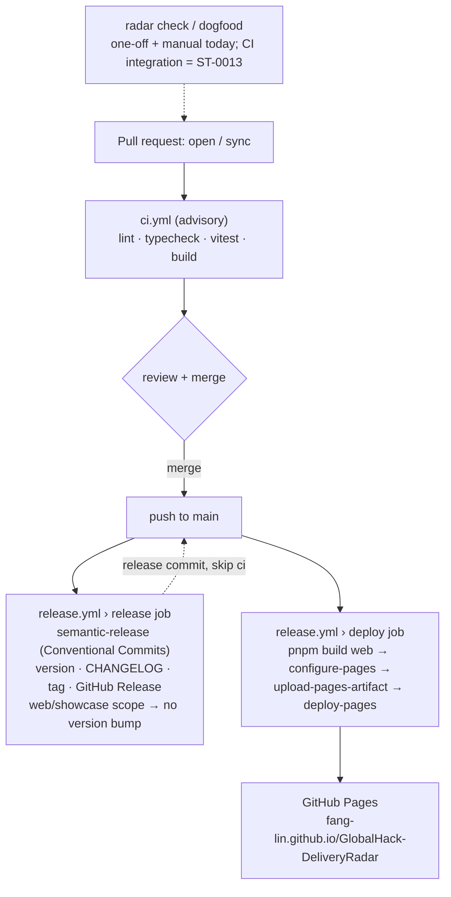

# ADR-0004: CI/CD via GitHub Actions — deploy Pages from the main repo, semantic-release (GitHub-only)

- **Status:** Accepted
- **Date:** 2026-06-17
- **Deciders:** Lin Fang
- **Related:** ST-0015 (the pipeline work); supersedes the manual deploy recipe in [ST-0001]/the deploy memory.

## Context

The showcase was deployed by hand: `npm run build` → `cp -R web/dist/. <clone>/` → commit/push a **separate** Pages repo (`GlobalHack-DeliveryRadar-pages`). This broke twice in one session — a wiped `/tmp` clone (lost `.git`) and a stale shell cwd after a folder rename — and there were no automated checks, so a type error or broken build could only be caught locally. The maintainer asked for a real pipeline: lint, unit tests, semantic-release, and Pages publish.

## Decision

Automate everything in **GitHub Actions**, on **Node 22**:

1. **`ci.yml`** (PRs + pushes to `main`): ESLint, typecheck (radar `tsc`, web `tsc --noEmit`), unit tests (`vitest`), and `vite build`. **Advisory** — it does not block merges (matches the product's "advisory, never blocks" stance).
2. **`release.yml`** (push to `main`): `semantic-release`, then build + deploy the SPA to Pages.
3. **Deploy Pages from the main repo** via the official `actions/upload-pages-artifact` + `actions/deploy-pages` (Pages source = "GitHub Actions"). **No secrets.** The separate `-pages` repo is **retired** (left in place, no longer deployed to).
4. **semantic-release is GitHub-only**: version + `CHANGELOG.md` + git tag + GitHub Release from **Conventional Commits**. **No npm publish.**
5. **One product version = the radar/CLI.** The `web/` showcase is the CLI's **documentation** and is *not* separately versioned — it always builds from the same commit as the CLI (same repo, deployed on every `main` push), so it cannot drift out of sync. semantic-release ignores `web`/`showcase`-scoped commits (via `commit-analyzer.releaseRules`), so site/doc changes **redeploy** the showcase but do **not** bump the CLI version (correct semver — docs don't change the CLI's API). If browsable multi-version docs (v1 vs v2) are ever needed, adopt a docs framework with versioning (Docusaurus/Starlight) — out of scope now.

## Pipeline design



Triggers, jobs, and artifacts are all **advisory and secret-free** (per the decisions above). On every push to `main` the two `release.yml` jobs run independently: `release` cuts a version only when commits warrant it, while `deploy` always republishes the showcase. The dashed `radar check` node is the dogfood (ADR-0004-C1) — run one-off/locally today; wiring it into CI on PRs is deferred to ST-0013.

## Consequences

- **Public URL changes** from `https://fang-lin.github.io/GlobalHack-DeliveryRadar-pages/` to **`https://fang-lin.github.io/GlobalHack-DeliveryRadar/`**. Update any link that pointed at the old URL; the old one keeps serving its last deploy until the `-pages` repo is deleted (maintainer's call — not deleted here).
- **Conventional Commits is now required** for `main` (so semantic-release can compute versions). We already mostly follow it (`feat/fix/docs/chore`).
- **One manual step the workflow can't do for you:** set repo **Settings → Pages → Source = "GitHub Actions"** once. `deploy-pages` needs `permissions: pages: write, id-token: write`; semantic-release needs `contents: write` (uses the built-in `GITHUB_TOKEN`, no PAT).
- The Anthropic-API **eval harness stays out of CI** (it costs money — hackathon key) — manual / `workflow_dispatch` only.
- The radar-on-PR product action (ST-0013) is unaffected and remains separate.

## Machine-checkable constraints

We dogfood this ADR: `radar extract` reads the block below; `radar check` evaluates PR diffs against it (advisory). One-off local checks for now; wiring it into CI is a later story.

```constraints
- id: ADR-0004-C1
  adr: ADR-0004
  title: CI/CD config must not embed secrets
  rule: >
    GitHub Actions workflows and any committed CI/CD configuration must never
    contain hardcoded secrets, tokens, API keys, or credentials. Secrets may be
    referenced only via GitHub Actions secrets (the secrets context) or OIDC —
    never inlined as a literal value in a committed file.
  polarity: prohibition
  driver: NFR-SEC — data-security red line (never commit keys/credentials)
  scope:
    paths: [".github/workflows/**"]
    layers: ["ci"]
  check:
    type: semantic
    matcher: null
    examples:
      compliant:
        - "token set from the secrets context, e.g. secrets.GITHUB_TOKEN"
        - "env var sourced from a repository/organization secret"
      violating:
        - "ANTHROPIC_API_KEY: sk-ant-<literal-value-committed-in-yaml>"
        - "token: ghp_<literal-personal-access-token>"
  enforce: advisory
  severity: high
  status: active
  superseded_by: null
- id: ADR-0004-C2
  adr: ADR-0004
  title: Pages deploys from the main repo via official actions
  rule: >
    The showcase must deploy to GitHub Pages from THIS repo using the official
    actions/upload-pages-artifact + actions/deploy-pages (Pages source = GitHub
    Actions). It must not deploy via a stored cross-repo deploy key / PAT, nor
    by pushing build output to a separate repo.
  polarity: requirement
  driver: ADR-0004 — no secrets, single source, retire the -pages repo
  scope:
    paths: [".github/workflows/**"]
    layers: ["ci", "deploy"]
  check:
    type: semantic
    matcher: null
    examples:
      compliant:
        - "actions/deploy-pages + actions/upload-pages-artifact from main"
      violating:
        - "peaceiris/actions-gh-pages with external_repository + a deploy key"
        - "git push to GlobalHack-DeliveryRadar-pages using a PAT secret"
  enforce: advisory
  severity: medium
  status: active
  superseded_by: null
- id: ADR-0004-C3
  adr: ADR-0004
  title: Releases stay GitHub-only (no npm publish)
  rule: >
    semantic-release must remain GitHub-only — tags + CHANGELOG + GitHub
    Release. @semantic-release/npm must keep npmPublish:false; no npm registry
    publish and no NPM_TOKEN. The radar is not distributed via npm.
  polarity: prohibition
  driver: ADR-0004 — Q2 decision, GitHub-only releases, no registry
  scope:
    paths: [".releaserc.json", ".github/workflows/release.yml"]
    layers: ["ci", "release"]
  check:
    type: semantic
    matcher: null
    examples:
      compliant:
        - "@semantic-release/npm with npmPublish false"
      violating:
        - "npmPublish set to true"
        - "adding NPM_TOKEN to release.yml"
        - "a publish step to the npm registry"
  enforce: advisory
  severity: low
  status: active
  superseded_by: null
```
