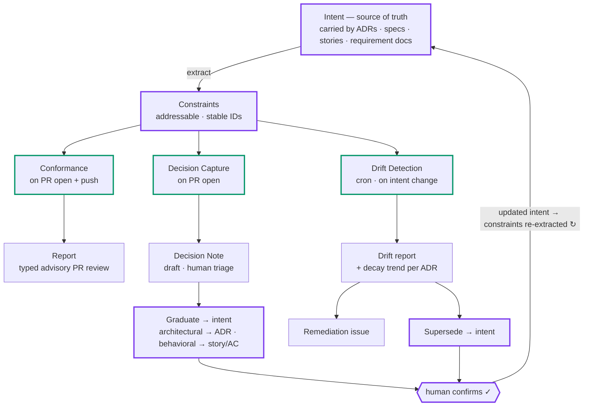

# Delivery Radar — Requirements Specification

> **Authoritative version: Chinese (`delivery-radar-requirements.zh.md`) · This file: synchronized English translation (original v1.0 text) · Last synced: 2026-06-12 · On conflict, the Chinese version prevails.**

**System:** Intent–Implementation Governance Engine
**Codename:** Delivery Radar (交付雷达)
**Document type:** Build specification for an autonomous coding agent
**Version:** 1.0
**Language of artifacts:** English (code, identifiers, ADRs, comments)

---

## 0. How to read this document

This is a build spec, not a marketing brief. It is written so that a coding
agent can scaffold a repository and implement it incrementally. Requirements are
tagged with stable IDs (`FR-*` functional, `NFR-*` non-functional, `DM-*` data
model). Where a requirement is deferred, it is marked `[Phase 2]` or `[Phase 3]`;
everything unmarked is Phase 1 (MVP).

The system is opinionated about **three things** that override convenience and
must never be silently dropped during implementation:

1. **Machine drafts, human confirms.** Every side-effectful action is *proposed*
   by the system and *confirmed* by a human. See `NFR-TRUST-1`.
2. **Advisory by default, gate only when earned.** The system reports; it blocks
   a merge only for a narrow, high-precision class of constraints. See `NFR-GATE-1`.
3. **The Constraint is the single shared contract.** All three operations read
   and write the same object. Do not fork it per operation. See `DM-CONSTRAINT`.

---

## 1. Purpose and problem statement

Code is now produced faster than humans can review it against *why* the code
exists. Changes pass compilation and CI yet silently violate the decisions and
intent that shaped the system, accelerating architectural decay.

Delivery Radar continuously aligns **intent** (recorded architectural decisions
and their business rationale) with **implementation** (the code and pull
requests). It does this through three operations over one shared object:

- **Conformance Check** (`conformance`, *Enforce*) — checks an incoming PR diff
  against the constraints that govern the touched code.
- **Drift Detection** (`drift`, *Audit*) — scans the standing codebase against
  all constraints, surfacing accumulated divergence and auditing whether the
  decisions themselves are still true.
- **Decision Capture** (`capture`, *Capture*) — detects decisions a PR makes
  implicitly but records nowhere, and turns them into recorded intent.

These form a closed loop that keeps intent from rotting (see §4).

---

## 2. Glossary (authoritative definitions)

| Term | Definition |
|------|------------|
| **ADR** | Architecture Decision Record. A durable, near-immutable record of one architecturally significant decision. Evolves only by **supersession** (a new ADR replaces it; the old one is marked superseded, never edited away). |
| **Constraint** | A discrete, addressable, machine-checkable rule extracted from an ADR. The atomic unit all three operations evaluate. Carries a stable ID, a scope, a check method, an enforcement level, and a link to its business `driver`. See `DM-CONSTRAINT`. |
| **driver** | A link from a constraint to the business rationale (e.g. an epic/story) that motivated the decision. Enables catching violations of the *reason* behind a decision, not just its letter. |
| **Decision Note** | A lightweight, draft record of a decision a PR appears to be making implicitly. Produced by `capture`. Graduates to an ADR (architectural) or folds into a story/AC (behavioral). |
| **Verdict** | The result of evaluating one constraint against code: `aligned` \| `violated` \| `unknown`, with evidence. |
| **Conformance Report** | The set of verdicts for one PR, plus routing metadata for projecting them into review elements. |
| **Drift Report** | Per-constraint violation counts, locations, trend over time, and the list of at-risk ADRs across the whole repo. |
| **Story / AC** | A user story and its acceptance criteria — the behavioral intent layer. `[Phase 2]` |
| **Per-diff engine** | The runtime that runs `conformance` + `capture` on PR events. |
| **Per-repo engine** | The runtime that runs `drift` on a schedule and on ADR changes. |
| **Constraint extraction core** | The shared component that turns prose ADRs into `Constraint` objects. The highest-value, hardest part of the system. |

---

## 3. Core concepts and intent layers

### 3.1 Source of truth

Intent lives in **version control**, as addressable atomic assertions, captured
as a byproduct of work. Two layers:

- **Architecture layer — ADRs** (Phase 1). Durable. Each ADR contains a
  human-readable body *and* a machine-readable constraint block.
- **Behavioral layer — Story / AC** (`[Phase 2]`). Fast-changing. The unit that
  maps to a PR (1:1 or few:1). Carries goal, expected behaviors, explicit
  non-goals, and business rationale.

A constraint may carry both: a **business-driven architectural decision** (e.g.
"inventory reads tolerate 5-minute staleness *because* the business accepts
stale reads") is an architecture constraint whose `driver` points at the
business reason. Catching violations of that reason is the system's
differentiating capability.

### 3.2 The Constraint as shared contract

`conformance` and `drift` both evaluate `(constraint, code) -> verdict`.
`capture` and the supersede action both *produce* ADRs that become constraints.
There is exactly one constraint schema (`DM-CONSTRAINT`) and one verdict shape
(`DM-VERDICT`).

---

## 4. The closed loop (system invariant)

```
            ┌──────────────────────────────────────────────┐
            │                                                │
            ▼                                                │
   ADR ──► Constraint ──► (read by) ──► Conformance          │
            │                          Drift                 │
            │                                                │
            │   Capture ──► Decision Note ──► Graduate ──► ADR┤
            │   Drift   ──► Drift Report  ──► Supersede ──► ADR┘
            │
   Constraint is re-extracted whenever an ADR is created or superseded.
```

- `capture` **produces** intent (new ADRs → new constraints).
- `conformance` **enforces** intent on incoming diffs.
- `drift` **audits** intent against the standing codebase and can conclude the
  *decision* is stale (→ supersede → new ADR → new constraints).
- Every new/changed ADR triggers constraint re-extraction and a `drift` rescan.

We name this closed loop the **IIAC Loop**
(Intent–Implementation Alignment & Convergence). Auditability is part of the
methodology, not an accessory: convergence is a trajectory property, and a
trajectory needs memory — without knowing the past, you cannot converge (this
is what the persistence in `NFR-EVAL-1` serves). Its expanded view (the three
pipelines, their artifacts, and the human-confirmation gate on intent
write-back — only the final convergence requires human confirmation):



**`FR-LOOP-1`** When an ADR is created or its status changes, the system MUST
re-run the constraint extraction core for that ADR and enqueue a `drift` rescan
scoped to the affected constraints.

---

## 5. Data model

### 5.1 `DM-CONSTRAINT` — Constraint

The atomic unit. Stored as structured data (YAML/JSON), extracted from an ADR's
machine-readable block.

```yaml
id: ADR-014-C2                  # REQUIRED. Stable, derived from ADR number + ordinal.
adr: ADR-014                    # REQUIRED. Provenance back-link.
title: Inventory reads tolerate eventual consistency   # REQUIRED. Short human label.
rule: >                         # REQUIRED. Normative statement. Human-readable AND
  Inventory read paths must tolerate up to 5 minutes    # fed to the semantic checker.
  of stale data and must not assume strong consistency.
polarity: requirement           # REQUIRED. requirement | prohibition
driver: epic-512                # OPTIONAL. Link to business rationale (epic/story/PRD).
scope:                          # REQUIRED. Drives retrieval — see NFR-RETRIEVAL-1.
  paths: ["services/inventory/**"]
  layers: ["read-model"]        # OPTIONAL. Logical layer tags.
check:                          # REQUIRED.
  type: semantic                # semantic | deterministic
  matcher: null                 # For deterministic: a semgrep/AST/regex rule string.
  examples:                     # OPTIONAL but strongly recommended (few-shot anchors).
    compliant: ["allow_stale=True", "cache-first read"]
    violating: ["SELECT ... FOR UPDATE on stock", "assert resp.is_fresh"]
enforce: advisory               # REQUIRED. advisory | gate  (see NFR-GATE-1)
severity: high                  # REQUIRED. low | medium | high
status: active                  # REQUIRED. active | superseded
superseded_by: null             # When superseded, the ADR/constraint id that replaces it.
```

**`DM-CONSTRAINT-1`** `enforce: gate` is only permitted when `check.type:
deterministic`. The extractor and validator MUST reject `gate` + `semantic`.

**`DM-CONSTRAINT-2`** `id` MUST be stable across re-extraction so historical
verdicts and human feedback remain attached.

### 5.2 `DM-ADR` — Architecture Decision Record

Markdown file at `docs/adr/ADR-<NNN>-<slug>.md`. Classic structure
(Context / Decision / Consequences / Status) **plus** a fenced
`constraints` block (YAML) that the extraction core parses.

- Status lifecycle: `Proposed` → `Accepted` → `Superseded`.
- The `Context` section SHOULD link the business `driver`.
- The `constraints` block is the source for `DM-CONSTRAINT` objects.

### 5.3 `DM-DECISION-NOTE` — Decision Note

```yaml
id: DN-2026-0042
pr: 1287                        # PR that triggered capture.
detected_decision: >            # What the PR appears to be deciding.
  Introduces direct HTTP call from orders service to inventory service.
evidence:                       # Diff hunks that constitute the decision.
  - file: services/orders/client.py
    lines: [44, 61]
suggested_class: architectural  # architectural | behavioral
draft_rationale: >              # Pulled from PR description / linked story.
  ...
status: draft                   # draft | confirmed | dismissed | graduated
graduated_to: null              # ADR id or story id once graduated.
```

**`DM-NOTE-1`** A Decision Note in `status: confirmed` that has not graduated
within a configurable window is itself a `drift` signal ("decision acknowledged
but not recorded"). See `FR-DRIFT-5`.

### 5.4 `DM-VERDICT` — Verdict

```yaml
constraint_id: ADR-014-C2
result: violated                # aligned | violated | unknown
confidence: 0.86                # 0..1
evidence:
  adr_clause: ADR-014-C2
  code:
    file: services/inventory/reader.py
    lines: [120, 134]
explanation: >                  # Why, in one or two sentences.
  ...
fix_locality: structural        # local | structural | none  (drives review projection)
```

### 5.5 `DM-CONF-REPORT` / `DM-DRIFT-REPORT`

- **Conformance Report**: `{ pr, commit_sha, verdicts: [DM-VERDICT], summary }`.
- **Drift Report**: `{ generated_at, per_constraint: [{constraint_id, violation_count, locations, trend}], at_risk_adrs: [{adr, violation_count, recommendation}] }`.

---

## 6. System architecture

### 6.1 Two runtimes, one shared core

- **Per-diff engine** — handles `conformance` + `capture`. Triggered by PR
  events. Operates on the diff. One pass over the PR produces both a Conformance
  Report and any Decision Notes.
- **Per-repo engine** — handles `drift`. Triggered by schedule and ADR changes.
  Operates on the whole tree. Produces a Drift Report. Never touches the build.
- **Constraint extraction core** — shared library used by both runtimes and by
  graduation. Turns ADRs into constraints.

**`FR-ARCH-1`** `conformance` and `capture` MUST share a single analysis pass
over the PR diff (do not fetch/parse the diff twice).

### 6.2 Constraint retrieval (the noise-control lever)

**`NFR-RETRIEVAL-1`** For a given PR, `conformance`/`capture` MUST only evaluate
constraints whose `scope.paths` match the changed files. Over-retrieval is the
primary cause of false positives and MUST be guarded against. Retrieval is by
path/ownership mapping first; semantic similarity is a secondary signal only.

---

## 7. Functional requirements — Conformance Check (`conformance`)

**Trigger**
- `FR-CONF-1` MUST run on PR `opened` and on every `synchronize` (push) event.
- `FR-CONF-2` SHOULD expose a pre-PR mode callable from a coding agent's loop
  (shift-left self-check), returning the same verdict shape.

**Behavior**
- `FR-CONF-3` Retrieve in-scope constraints (`NFR-RETRIEVAL-1`).
- `FR-CONF-4` For each constraint, produce a `DM-VERDICT` (`aligned` /
  `violated` / `unknown`) with evidence linking the ADR clause to the code hunk.
- `FR-CONF-5` `deterministic` constraints are evaluated by running their
  `matcher` (e.g. semgrep/AST). `semantic` constraints are evaluated by an LLM
  grounded with `rule` + `driver` rationale + `examples`.
- `FR-CONF-6` `unknown` is a first-class result. The checker MUST emit `unknown`
  rather than guess when evidence is insufficient.

**Output — projection into PR review (typed, not uniform comments)**
- `FR-CONF-7` Each verdict is projected based on `result`, `confidence`, and
  `fix_locality`:
  - high-confidence + `fix_locality: local` → inline review comment **with a
    GitHub `suggestion` block** (one-click apply).
  - high-confidence + `fix_locality: structural` → inline comment citing the
    ADR clause and the *direction* of the required change; **no suggestion block**.
  - low-confidence / `unknown` → folded into a single summary comment (no inline
    noise).
  - a verdict that is actually an undocumented decision → routed to `capture`
    (becomes a Decision Note), **not** a "fix this" suggestion.
- `FR-CONF-8` A GitHub **status check** is posted. Default state is neutral
  (informational). It transitions to a failing/required state **only** for
  constraints with `enforce: gate` (see `NFR-GATE-1`).
- `FR-CONF-9` Review state defaults to **Comment** (non-blocking). **Request
  changes** is used only when at least one `enforce: gate` constraint is
  `violated`.

**Feedback**
- `FR-CONF-10` Each posted verdict MUST be linkable to a human signal
  (👍/👎 / resolved-as-correct / dismissed). Signals are persisted for precision
  monitoring and as an evaluation set (`NFR-EVAL-1`).

---

## 8. Functional requirements — Drift Detection (`drift`)

**Trigger**
- `FR-DRIFT-1` MUST run on a schedule (configurable; default nightly on the
  default branch).
- `FR-DRIFT-2` MUST run on ADR change (create / accept / supersede), scoped to
  the affected constraints (`FR-LOOP-1`).
- `FR-DRIFT-3` MAY run as an incremental scan post-merge to the default branch.
- `FR-DRIFT-0` MUST NOT participate in the build/merge gate in any way.

**Behavior**
- `FR-DRIFT-4` Scan the whole tree (or the affected scope) against active
  constraints; produce a `DM-DRIFT-REPORT` with per-constraint violation counts,
  locations, and trend over time.
- `FR-DRIFT-5` Treat a `confirmed`-but-not-`graduated` Decision Note older than
  the configured window as a drift signal (`DM-NOTE-1`).
- `FR-DRIFT-6` For each at-risk ADR (heavily/violated or fast-decaying), the
  report MUST present the human a binary choice with **machine-drafted** options:
  - **Remediation** — draft an issue to refactor code back into conformance
    (assignable, may target an agent); OR
  - **Supersede** — draft a new ADR that supersedes the stale one (updates intent).
- `FR-DRIFT-7` Neither action is executed automatically. Both require human
  confirmation (`NFR-TRUST-1`).

**Output surface**
- `FR-DRIFT-8` Results land on a dashboard/report for architects/tech-leads,
  including the decay trend per ADR. Not posted on PRs.

---

## 9. Functional requirements — Decision Capture (`capture`)

**Trigger**
- `FR-CAP-1` Runs on the same trigger and the same diff pass as `conformance`
  (PR `opened` + `synchronize`). It does **not** run after merge.

**Detection**
- `FR-CAP-2` Detect when a diff appears to *make a decision not covered by any
  active constraint* — e.g. introduces a new dependency, datastore, or
  cross-service call pattern. The most valuable captures are decisions the PR
  makes *implicitly*, not merely undocumented ones.
- `FR-CAP-3` Produce a draft `DM-DECISION-NOTE` with detected decision, evidence
  hunks, suggested class (`architectural`/`behavioral`), and a draft rationale
  drawn from the PR description / linked story.

**Triage gate (human)**
- `FR-CAP-4` The Decision Note is posted as a lightweight PR comment/annotation.
  A human triages with three questions:
  1. Is this a real decision? (else → `dismissed`)
  2. Is it architecturally significant? (else → route to story/AC `[Phase 2]`)
  3. Is it net-new, or already covered by an existing ADR? (if covered, it is a
     `conformance`/`drift` matter, not a new ADR — do not create a duplicate.)
- `FR-CAP-5` The system MUST NOT create an issue or ADR on detection. Issues/ADRs
  are created only on human confirmation.

**Graduation (Decision Note → ADR)**
- `FR-CAP-6` On confirmation of an architectural, net-new decision, expand the
  note into a full ADR draft: Context (with `driver` link), Decision,
  Consequences, `Status: Proposed`, and a machine-readable `constraints` block.
  The human's primary editing target is the constraint block.
- `FR-CAP-7` Vessel: prefer opening a **draft PR** that adds
  `docs/adr/ADR-<NNN>.md`. An **issue** ("write ADR for X") is the alternative
  when the decision needs discussion before drafting. The issue closes when the
  ADR PR merges.
- `FR-CAP-8` On ADR PR merge, status flips `Proposed → Accepted`; the extraction
  core emits constraints; `FR-LOOP-1` fires.
- `FR-CAP-9` Graduation MUST NOT block the PR that triggered capture. The
  triggering PR may merge; the ADR follows asynchronously. The confirmed Note is
  the placeholder until then.

---

## 10. Functional requirements — Constraint extraction core

- `FR-EXT-1` Parse an ADR's machine-readable `constraints` block into
  `DM-CONSTRAINT` objects with stable IDs.
- `FR-EXT-2` `[Phase 2]` Assist authoring: given an ADR body and (optionally) a
  PR diff, draft candidate constraints — including a best-effort `scope` and a
  proposed `check.type` and `matcher`. Human edits and confirms.
- `FR-EXT-3` Validate every constraint against `DM-CONSTRAINT-1` (no
  `gate`+`semantic`) and `DM-CONSTRAINT-2` (id stability).

---

## 11. Integration requirements

- `FR-INT-1` GitHub: consume PR webhook events; post via the **Checks API**
  (status) and **Reviews API** (comments + `suggestion` blocks); run as a
  **GitHub Action** in CI for the per-diff engine.
- `FR-INT-2` Repository layout: ADRs at `docs/adr/`; constraint store derived
  from them (cache acceptable, ADRs are the source of truth).
- `FR-INT-3` Per-repo engine runs as a scheduled job (cron) plus an ADR-change
  hook.
- `FR-INT-4` `[Phase 2]` Issue tracker (GitHub Issues or Linear) as a
  configurable destination for remediation issues and behavioral Decision Notes.
- `FR-INT-5` Deterministic checks SHOULD integrate an existing engine
  (e.g. semgrep) rather than reimplement matching.

---

## 12. Non-functional requirements

- `NFR-TRUST-1` **Machine drafts, human confirms.** Every side-effectful action
  — gating a merge, creating an ADR, superseding an ADR, filing a remediation
  issue, committing a Decision Note — is proposed by the system and executed only
  on explicit human confirmation. Permission is per-action; one approval never
  generalizes to later actions.
- `NFR-GATE-1` **Advisory by default.** A constraint blocks a merge only if
  `enforce: gate` AND `check.type: deterministic` AND its precision has been
  demonstrated. All `semantic` constraints are advisory. The default for a new
  constraint is `advisory`.
- `NFR-RETRIEVAL-1` Scope-first retrieval (see §6.2). Over-retrieval is a defect.
- `NFR-EVAL-1` **Measurability.** Persist every verdict and its human signal.
  Provide a historical-replay harness (`§14`) so precision/recall can be measured
  on past PRs before any constraint is promoted to `gate`.
- `NFR-PERF-1` The per-diff engine MUST complete within typical CI time budgets;
  bound LLM calls by scoping (`NFR-RETRIEVAL-1`) and prefer batching.
- `NFR-SEC-1` Least-privilege tokens. The system reads code and writes review
  comments / draft PRs / draft issues only. It MUST NOT modify access controls,
  branch protection, or repository settings.
- `NFR-EXPLAIN-1` Every `violated` verdict MUST carry evidence (ADR clause ↔ code
  hunk) and a short explanation. No unexplained blocks.
- `NFR-CONFIG-1` Thresholds (confidence cutoffs, drift schedule, ungraduated-note
  window, gate enablement per constraint) are configuration, not code.

---

## 13. Phasing / build order

**Phase 1 (MVP) — advisory architecture conformance + capture, on PRs**
- Constraint store from hand-authored ADR `constraints` blocks (`FR-EXT-1`).
- `conformance` on PR events, advisory only, typed review projection
  (`FR-CONF-1..10`).
- `capture` detection + Decision Note + manual triage + graduation to ADR
  (`FR-CAP-*`).
- The loop: ADR change → re-extract constraints (`FR-LOOP-1`).
- Historical-replay harness (`§14`).
- Deterministic checks via semgrep; semantic checks via LLM grounded with
  `rule` + `driver` + `examples`.

**Phase 2**
- `drift` per-repo engine + dashboard + remediation/supersede drafts.
- Behavioral layer (Story / AC) and behavioral capture routing.
- Constraint authoring assistance (`FR-EXT-2`).
- Issue-tracker destinations (`FR-INT-4`).

**Phase 3**
- Gate enablement for proven-precision deterministic constraints (`NFR-GATE-1`).
- Pre-PR agent-loop self-check (`FR-CONF-2`).
- Drift prediction / decay trend analytics.

---

## 14. Validation / acceptance

The central hypothesis to validate first: **a semantic check grounded with the
business `driver` catches a class of violations — "letter honored, reason
defeated" — that structural linters and ungrounded AI review both miss.**

- `AC-1` Historical-replay harness: run `conformance` over a corpus of merged
  PRs in an ADR-rich repository; compare catch-rate against (a) a structural/
  static baseline and (b) an ungrounded LLM baseline.
- `AC-2` Report precision and recall per `check.type`. No constraint is promoted
  to `enforce: gate` until precision on the replay set clears a configured bar.
- `AC-3` Demonstrable artifact: for at least one PR that was green on CI, show
  the ADR clause it quietly violated and the review comment the system would have
  posted.

---

## 15. Out of scope (v1)

- Auto-applying fixes without human confirmation.
- Hard-gating on `semantic` verdicts.
- Building an architecture-modeling/diagramming product (constraints come from
  ADRs, not a maintained model).
- Cross-organization code search / multi-repo dependency graphs.
- Replacing CI test coverage — the system checks intent alignment, not whether
  acceptance criteria pass (tests do that).

---

## 16. Suggested (non-binding) tech notes

- Language/runtime: implementer's choice; favor something with strong GitHub
  Action and semgrep ecosystem support.
- Deterministic matching: semgrep (or AST-based equivalents per language).
- Semantic checking: Anthropic API; ground each call with the constraint `rule`,
  the `driver` rationale, and `examples`; request the `DM-VERDICT` shape as
  structured output; treat `unknown` as a valid response.
- Constraint store: derive-on-demand from ADRs with a cache; ADRs remain the
  source of truth in `docs/adr/`.
- Persist verdicts + human signals in a small store for `NFR-EVAL-1`.

---

*End of specification.*
