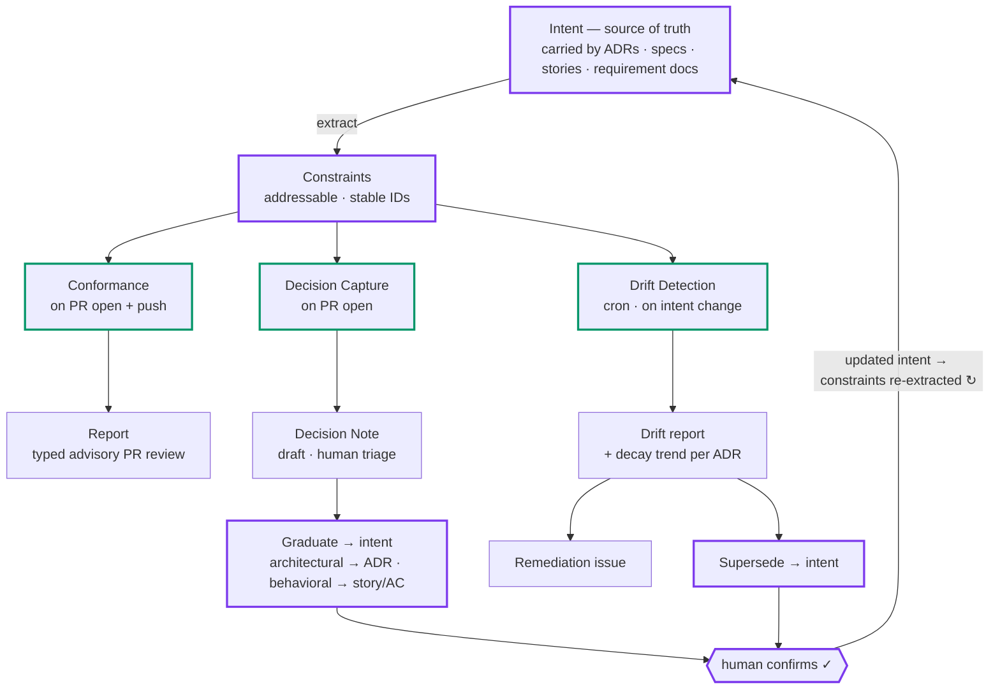

# 交付雷达（Delivery Radar）— 需求规格说明书

> **权威: 中文（本文件） · 翻译: 英文（`delivery-radar-requirements.en.md`，原始 v1.0 文本） · 最后同步: 2026-06-12 · 两版冲突以中文为准**
>
> 本文档译自原始英文规格 v1.0；自 2026-06-12 起，中文版为权威版本，英文版作为同步翻译维护。

**系统：** 意图—实现治理引擎（Intent–Implementation Governance Engine）
**代号：** Delivery Radar（交付雷达）
**文档类型：** 面向自主编码代理的构建规格（build specification）
**版本：** 1.0
**产物语言：** 英文（代码、标识符、ADR、注释）

---

## 0. 如何阅读本文档

这是一份构建规格，不是营销简报。它的写法旨在让编码代理能够据此搭建仓库脚手架并增量实现。需求均带有稳定 ID（`FR-*` 功能性、`NFR-*` 非功能性、`DM-*` 数据模型）。被推迟的需求标注为 `[Phase 2]` 或 `[Phase 3]`；所有未标注的都属于 Phase 1（MVP）。

本系统在**三件事**上立场鲜明，它们优先于一切实现上的便利，且在实现过程中绝不允许被悄悄丢弃：

1. **机器起草，人类确认。** 每一个有副作用的动作都由系统*提议*、由人类*确认*。见 `NFR-TRUST-1`。
2. **默认仅建议（advisory），门禁（gate）须靠实绩挣得。** 系统以报告为主；只对一类范围狭窄、高精度的约束阻断 merge。见 `NFR-GATE-1`。
3. **Constraint（约束）是唯一的共享契约。** 三个操作读写同一个对象。不得按操作各自分叉。见 `DM-CONSTRAINT`。

---

## 1. 目的与问题陈述

如今代码的生产速度已超过人类对照"代码*为何*存在"进行评审的速度。变更通过了编译和 CI，却悄悄违背了塑造系统的那些决策与意图，加速着架构的腐化。

Delivery Radar 持续对齐**意图**（已记录的架构决策及其业务理由）与**实现**（代码和 pull request）。它通过作用于同一个共享对象的三个操作来做到这一点：

- **一致性检查（Conformance Check）**（`conformance`，*执行/Enforce*）— 将进入的 PR diff 对照其触及代码所受的约束进行检查。
- **漂移检测（Drift Detection）**（`drift`，*审计/Audit*）— 将存量代码库对照全部约束进行扫描，揭示累积的偏离，并审计这些决策本身是否仍然成立。
- **决策捕获（Decision Capture）**（`capture`，*捕获/Capture*）— 发现 PR 隐式做出却无处记录的决策，并将其转化为被记录的意图。

三者构成一个防止意图腐烂的闭环（见 §4）。

---

## 2. 术语表（权威定义）

| 术语 | 定义 |
|------|------|
| **ADR** | 架构决策记录（Architecture Decision Record）。对单个具有架构意义的决策的持久、近乎不可变的记录。仅通过**取代（supersession）**演进（新 ADR 取代旧 ADR；旧的被标记为 superseded，绝不被就地改写）。 |
| **Constraint（约束）** | 从 ADR 中提取出的离散、可寻址、机器可检查的规则。三个操作所评估的原子单元。携带稳定 ID、作用域（scope）、检查方法、执行级别，以及指向其业务 `driver` 的链接。见 `DM-CONSTRAINT`。 |
| **driver（业务动因）** | 从约束指向促成该决策的业务理由（如某个 epic/story）的链接。使系统能够捕捉对决策*理由*的违背，而不仅是对其字面的违背。 |
| **Decision Note（决策笔记）** | 对 PR 看似隐式做出的某个决策的轻量草稿记录。由 `capture` 产出。可毕业为 ADR（架构性）或并入 story/AC（行为性）。 |
| **Verdict（裁定）** | 将一条约束对照代码评估的结果：`aligned` \| `violated` \| `unknown`，附证据。 |
| **Conformance Report（一致性报告）** | 一个 PR 的全部裁定集合，外加将其投影为评审元素所需的路由元数据。 |
| **Drift Report（漂移报告）** | 按约束统计的违规计数、位置、随时间的趋势，以及全仓库范围内处于风险中的 ADR 列表。 |
| **Story / AC** | 用户故事及其验收标准（acceptance criteria）— 行为意图层。`[Phase 2]` |
| **Per-diff engine（按 diff 引擎）** | 在 PR 事件上运行 `conformance` + `capture` 的运行时。 |
| **Per-repo engine（按仓库引擎）** | 按计划任务及 ADR 变更时运行 `drift` 的运行时。 |
| **Constraint extraction core（约束提取核心）** | 将散文体 ADR 转化为 `Constraint` 对象的共享组件。系统中价值最高、难度最大的部分。 |

---

## 3. 核心概念与意图分层

### 3.1 单一事实来源

意图存放于**版本控制**之中，以可寻址的原子断言形式存在，作为日常工作的副产品被捕获。分为两层：

- **架构层 — ADR**（Phase 1）。持久。每个 ADR 同时包含人类可读的正文*和*机器可读的约束块（constraint block）。
- **行为层 — Story / AC**（`[Phase 2]`）。快速变化。与 PR 形成映射的单元（1:1 或少数:1）。承载目标、预期行为、显式的非目标（non-goals）以及业务理由。

一条约束可以两者兼具：一个**由业务驱动的架构决策**（例如"库存读取容忍 5 分钟陈旧度，*因为*业务接受过期读"）是一条架构约束，其 `driver` 指向业务理由。捕捉对该理由的违背，正是本系统的差异化能力。

### 3.2 Constraint 作为共享契约

`conformance` 和 `drift` 都执行 `(constraint, code) -> verdict` 的评估。`capture` 与取代（supersede）动作则都会*产出*成为约束来源的 ADR。约束模式（schema）只有一个（`DM-CONSTRAINT`），裁定形状也只有一个（`DM-VERDICT`）。

---

## 4. 闭环（系统不变式）

```
            ┌──────────────────────────────────────────────┐
            │                                                │
            ▼                                                │
   ADR ──► Constraint ──► (read by) ──► Conformance          │
            │                          Drift                 │
            │                                                │
            │   Capture ──► Decision Note ──► Graduate ──► ADR┤
            │   Drift   ──► Drift Report  ──► Supersede ──► ADR┘
            │
   Constraint is re-extracted whenever an ADR is created or superseded.
```

- `capture` **产出**意图（新 ADR → 新约束）。
- `conformance` 在进入的 diff 上**执行**意图。
- `drift` 将意图对照存量代码库进行**审计**，并可能得出"该*决策*已过时"的结论（→ 取代 → 新 ADR → 新约束）。
- 每个新建或变更的 ADR 都会触发约束的重新提取和一次 `drift` 重扫。

我们将这个闭环命名为 **IIAC Loop**（Intent–Implementation Alignment & Convergence）。可审计性是该方法论的组成部分而非附属品：收敛是轨迹性质，轨迹需要记忆——不知道过去，就无法收敛（`NFR-EVAL-1` 的持久化正为此服务）。其展开视图（三管线、各自产物，以及意图写回处的人工确认门——只有最终的收敛需要人来确认）：



**`FR-LOOP-1`** 当一个 ADR 被创建或其状态发生变化时，系统 MUST 对该 ADR 重新运行约束提取核心，并将一次限定于受影响约束范围的 `drift` 重扫加入队列。

---

## 5. 数据模型

### 5.1 `DM-CONSTRAINT` — Constraint（约束）

原子单元。以结构化数据（YAML/JSON）存储，提取自 ADR 的机器可读块。

```yaml
id: ADR-014-C2                  # REQUIRED. Stable, derived from ADR number + ordinal.
adr: ADR-014                    # REQUIRED. Provenance back-link.
title: Inventory reads tolerate eventual consistency   # REQUIRED. Short human label.
rule: >                         # REQUIRED. Normative statement. Human-readable AND
  Inventory read paths must tolerate up to 5 minutes    # fed to the semantic checker.
  of stale data and must not assume strong consistency.
polarity: requirement           # REQUIRED. requirement | prohibition
driver: epic-512                # OPTIONAL. Link to business rationale (epic/story/PRD).
scope:                          # REQUIRED. Drives retrieval — see NFR-RETRIEVAL-1.
  paths: ["services/inventory/**"]
  layers: ["read-model"]        # OPTIONAL. Logical layer tags.
check:                          # REQUIRED.
  type: semantic                # semantic | deterministic
  matcher: null                 # For deterministic: a semgrep/AST/regex rule string.
  examples:                     # OPTIONAL but strongly recommended (few-shot anchors).
    compliant: ["allow_stale=True", "cache-first read"]
    violating: ["SELECT ... FOR UPDATE on stock", "assert resp.is_fresh"]
enforce: advisory               # REQUIRED. advisory | gate  (see NFR-GATE-1)
severity: high                  # REQUIRED. low | medium | high
status: active                  # REQUIRED. active | superseded
superseded_by: null             # When superseded, the ADR/constraint id that replaces it.
```

**`DM-CONSTRAINT-1`** 只有当 `check.type: deterministic` 时才允许 `enforce: gate`。提取器和校验器 MUST 拒绝 `gate` + `semantic` 的组合。

**`DM-CONSTRAINT-2`** `id` MUST 在重新提取后保持稳定，以使历史裁定和人类反馈得以持续关联。

### 5.2 `DM-ADR` — 架构决策记录

位于 `docs/adr/ADR-<NNN>-<slug>.md` 的 Markdown 文件。经典结构（Context / Decision / Consequences / Status）**外加**一个围栏式的 `constraints` 块（YAML），由提取核心解析。

- 状态生命周期：`Proposed` → `Accepted` → `Superseded`。
- `Context` 一节 SHOULD 链接业务 `driver`。
- `constraints` 块是 `DM-CONSTRAINT` 对象的来源。

### 5.3 `DM-DECISION-NOTE` — Decision Note（决策笔记）

```yaml
id: DN-2026-0042
pr: 1287                        # PR that triggered capture.
detected_decision: >            # What the PR appears to be deciding.
  Introduces direct HTTP call from orders service to inventory service.
evidence:                       # Diff hunks that constitute the decision.
  - file: services/orders/client.py
    lines: [44, 61]
suggested_class: architectural  # architectural | behavioral
draft_rationale: >              # Pulled from PR description / linked story.
  ...
status: draft                   # draft | confirmed | dismissed | graduated
graduated_to: null              # ADR id or story id once graduated.
```

**`DM-NOTE-1`** 处于 `status: confirmed` 但在可配置时间窗口内未毕业的 Decision Note，本身就是一个 `drift` 信号（"决策已被认可但未被记录"）。见 `FR-DRIFT-5`。

### 5.4 `DM-VERDICT` — Verdict（裁定）

```yaml
constraint_id: ADR-014-C2
result: violated                # aligned | violated | unknown
confidence: 0.86                # 0..1
evidence:
  adr_clause: ADR-014-C2
  code:
    file: services/inventory/reader.py
    lines: [120, 134]
explanation: >                  # Why, in one or two sentences.
  ...
fix_locality: structural        # local | structural | none  (drives review projection)
```

### 5.5 `DM-CONF-REPORT` / `DM-DRIFT-REPORT`

- **Conformance Report（一致性报告）**：`{ pr, commit_sha, verdicts: [DM-VERDICT], summary }`。
- **Drift Report（漂移报告）**：`{ generated_at, per_constraint: [{constraint_id, violation_count, locations, trend}], at_risk_adrs: [{adr, violation_count, recommendation}] }`。

---

## 6. 系统架构

### 6.1 两个运行时，一个共享核心

- **按 diff 引擎（Per-diff engine）** — 负责 `conformance` + `capture`。由 PR 事件触发。作用于 diff。对 PR 的一次扫描同时产出 Conformance Report 和（如有）Decision Note。
- **按仓库引擎（Per-repo engine）** — 负责 `drift`。由计划任务和 ADR 变更触发。作用于整棵代码树。产出 Drift Report。绝不触碰构建（build）。
- **约束提取核心（Constraint extraction core）** — 两个运行时及毕业（graduation）流程共用的库。将 ADR 转化为约束。

**`FR-ARCH-1`** `conformance` 和 `capture` MUST 共享对 PR diff 的单次分析扫描（不得重复抓取/解析 diff）。

### 6.2 约束检索（噪声控制的关键杠杆）

**`NFR-RETRIEVAL-1`** 对于给定的 PR，`conformance`/`capture` MUST 只评估其 `scope.paths` 与变更文件匹配的约束。过度检索（over-retrieval）是误报的首要来源，MUST 加以防范。检索首先依据路径/归属映射；语义相似度仅作为次级信号。

---

## 7. 功能需求 — 一致性检查（`conformance`）

**触发**
- `FR-CONF-1` MUST 在 PR `opened` 及每次 `synchronize`（push）事件上运行。
- `FR-CONF-2` SHOULD 暴露一种可从编码代理的循环中调用的 pre-PR 模式（左移自检，shift-left self-check），返回相同的裁定形状。

**行为**
- `FR-CONF-3` 检索作用域内的约束（`NFR-RETRIEVAL-1`）。
- `FR-CONF-4` 对每条约束产出一个 `DM-VERDICT`（`aligned` / `violated` / `unknown`），附带将 ADR 条款与代码 hunk 关联起来的证据。
- `FR-CONF-5` `deterministic` 约束通过运行其 `matcher`（如 semgrep/AST）来评估。`semantic` 约束由以 `rule` + `driver` 理由 + `examples` 锚定（grounded）的 LLM 来评估。
- `FR-CONF-6` `unknown` 是一等结果。当证据不足时，检查器 MUST 给出 `unknown` 而非猜测。

**输出 — 投影为 PR 评审元素（分型投影，而非千篇一律的评论）**
- `FR-CONF-7` 每个裁定根据 `result`、`confidence` 和 `fix_locality` 进行投影：
  - 高置信 + `fix_locality: local` → 行内评审评论，**带 GitHub `suggestion` 块**（一键应用）。
  - 高置信 + `fix_locality: structural` → 行内评论，引用 ADR 条款并指出所需变更的*方向*；**不带 suggestion 块**。
  - 低置信 / `unknown` → 折叠进单条汇总评论（不制造行内噪声）。
  - 实为"未记录的决策"的裁定 → 路由给 `capture`（成为 Decision Note），而**不是**一条"请修复"的建议。
- `FR-CONF-8` 发布一个 GitHub **status check**。默认状态为 neutral（仅供参考）。**仅当**存在 `enforce: gate` 的约束（见 `NFR-GATE-1`）时才转为 failing/required 状态。
- `FR-CONF-9` 评审状态默认为 **Comment**（不阻断）。**Request changes** 仅在至少一条 `enforce: gate` 约束被判 `violated` 时使用。

**反馈**
- `FR-CONF-10` 每条已发布的裁定 MUST 可关联一个人类信号（👍/👎 / 按正确解决 / 已忽略）。信号被持久化，用于精度监控并构成评估集（`NFR-EVAL-1`）。

---

## 8. 功能需求 — 漂移检测（`drift`）

**触发**
- `FR-DRIFT-1` MUST 按计划任务运行（可配置；默认每夜在默认分支上运行）。
- `FR-DRIFT-2` MUST 在 ADR 变更（创建 / 接受 / 取代）时运行，范围限定于受影响的约束（`FR-LOOP-1`）。
- `FR-DRIFT-3` MAY 在 merge 进默认分支后做增量扫描。
- `FR-DRIFT-0` MUST NOT 以任何方式参与构建/merge 门禁。

**行为**
- `FR-DRIFT-4` 将整棵代码树（或受影响范围）对照活跃约束进行扫描；产出 `DM-DRIFT-REPORT`，含按约束的违规计数、位置和随时间的趋势。
- `FR-DRIFT-5` 将超过配置时间窗口、`confirmed` 但未 `graduated` 的 Decision Note 视为漂移信号（`DM-NOTE-1`）。
- `FR-DRIFT-6` 对每个处于风险中的 ADR（被大量违反或快速衰减），报告 MUST 向人类呈现一个二选一、且选项均已**由机器起草**的决定：
  - **整改（Remediation）** — 起草一个将代码重构回一致状态的 issue（可指派，可指向某个 agent）；或
  - **取代（Supersede）** — 起草一个取代过时 ADR 的新 ADR（更新意图）。
- `FR-DRIFT-7` 两个动作都不自动执行。两者均需人类确认（`NFR-TRUST-1`）。

**输出界面**
- `FR-DRIFT-8` 结果落在面向架构师/技术负责人的仪表盘/报告中，包含每个 ADR 的衰减趋势。不发布到 PR 上。

---

## 9. 功能需求 — 决策捕获（`capture`）

**触发**
- `FR-CAP-1` 与 `conformance` 共用同一触发器和同一次 diff 扫描（PR `opened` + `synchronize`）。它**不**在 merge 之后运行。

**检测**
- `FR-CAP-2` 检测 diff 看似*做出了不被任何活跃约束覆盖的决策*的情形 — 例如引入新依赖、新数据存储或新的跨服务调用模式。最有价值的捕获对象是 PR *隐式*做出的决策，而不仅仅是未记录的决策。
- `FR-CAP-3` 产出草稿态的 `DM-DECISION-NOTE`，含检测到的决策、证据 hunk、建议分类（`architectural`/`behavioral`），以及从 PR 描述/关联 story 提取的理由草稿。

**分诊门（人类）**
- `FR-CAP-4` Decision Note 以轻量 PR 评论/批注的形式发布。人类用三个问题分诊：
  1. 这是真决策吗？（否则 → `dismissed`）
  2. 它具有架构意义吗？（否则 → 路由至 story/AC `[Phase 2]`）
  3. 它是净新增，还是已被某个既有 ADR 覆盖？（若已被覆盖，则属于 `conformance`/`drift` 的事务，不是新 ADR — 不要创建重复项。）
- `FR-CAP-5` 系统 MUST NOT 在检测时创建 issue 或 ADR。issue/ADR 仅在人类确认后创建。

**毕业（Decision Note → ADR）**
- `FR-CAP-6` 当一个架构性、净新增的决策被确认后，将笔记扩展为完整的 ADR 草稿：Context（含 `driver` 链接）、Decision、Consequences、`Status: Proposed`，以及机器可读的 `constraints` 块。人类的主要编辑对象是约束块。
- `FR-CAP-7` 载体：优先开一个添加 `docs/adr/ADR-<NNN>.md` 的**草稿 PR**。当决策在起草前还需要讨论时，备选方案是一个 **issue**（"为 X 撰写 ADR"）。该 issue 在 ADR PR merge 时关闭。
- `FR-CAP-8` ADR PR merge 时，状态翻转 `Proposed → Accepted`；提取核心产出约束；`FR-LOOP-1` 被触发。
- `FR-CAP-9` 毕业流程 MUST NOT 阻塞触发 capture 的那个 PR。触发 PR 可以先 merge；ADR 异步跟进。在此之前，已确认的 Note 充当占位。

---

## 10. 功能需求 — 约束提取核心

- `FR-EXT-1` 将 ADR 的机器可读 `constraints` 块解析为具有稳定 ID 的 `DM-CONSTRAINT` 对象。
- `FR-EXT-2` `[Phase 2]` 辅助撰写：给定 ADR 正文和（可选的）PR diff，起草候选约束 — 包括尽力而为的 `scope` 以及建议的 `check.type` 和 `matcher`。由人类编辑并确认。
- `FR-EXT-3` 对照 `DM-CONSTRAINT-1`（禁止 `gate`+`semantic`）和 `DM-CONSTRAINT-2`（id 稳定性）校验每一条约束。

---

## 11. 集成需求

- `FR-INT-1` GitHub：消费 PR webhook 事件；通过 **Checks API**（状态）和 **Reviews API**（评论 + `suggestion` 块）发布；按 diff 引擎以 **GitHub Action** 形式在 CI 中运行。
- `FR-INT-2` 仓库布局：ADR 位于 `docs/adr/`；约束存储由其派生（可以有缓存，ADR 是事实来源）。
- `FR-INT-3` 按仓库引擎以计划任务（cron）外加 ADR 变更钩子的形式运行。
- `FR-INT-4` `[Phase 2]` issue 跟踪器（GitHub Issues 或 Linear）作为整改 issue 和行为类 Decision Note 的可配置目的地。
- `FR-INT-5` 确定性检查 SHOULD 集成现有引擎（如 semgrep），而非重新实现匹配。
- `FR-INT-6` `radar check` 在 CI 中的运行由**用户发起**，以控制 LLM 成本（`NFR-COST-1`）；触发方式有三种、都在 PR 现场或 Actions 里：**PR 评论命令 `/radar`**、给 PR 打 **`radar` 标签**、或 **`workflow_dispatch`**（Actions 的 "Run workflow" 按钮 + PR 号）。评论触发 SHOULD 校验评论者具备写权限。无论触发方式如何，保持 **advisory**——经 Reviews API 以 `COMMENT` 事件发布，绝不阻塞 merge。首个落地形态：对本仓库自身的 PR 做检查（dogfood，见 `ST-0013` / `ST-0008`）。
- `FR-INT-7` **进度可见（sticky 进度评审）。** 一次 `radar check` 被触发后（`FR-INT-6`），系统 SHOULD **立即**在该 PR 上发布一条可见的 advisory 评审（Reviews API，`COMMENT` 事件），内容为"检查已开始"占位 + 指向本次运行实时日志的链接；运行结束后**就地编辑同一条评审**为最终裁定投影（`FR-CONF-7`），若运行失败则就地编辑为失败说明 + 日志链接。目的：PR 上始终反映检查的当前状态（开始 / 完成 / 失败），绝不残留"正在运行"的僵尸状态；一次运行只占用一条评审，跨多次运行各自新建（每次检查是一条可审计记录，`NFR-EVAL-1`）。状态始终为 `COMMENT`（不阻断，`FR-CONF-9`）。

---

## 12. 非功能需求

- `NFR-TRUST-1` **机器起草，人类确认。** 每一个有副作用的动作 — 阻断 merge、创建 ADR、取代 ADR、提交整改 issue、落盘 Decision Note — 都由系统提议，且只在人类显式确认后执行。许可按动作逐一授予；一次批准绝不泛化到后续动作。
- `NFR-GATE-1` **默认仅建议。** 一条约束只有在 `enforce: gate` 且 `check.type: deterministic` 且其精度已被实证之后才能阻断 merge。所有 `semantic` 约束都是建议性的。新建约束的默认值是 `advisory`。
- `NFR-RETRIEVAL-1` 作用域优先的检索（见 §6.2）。过度检索是缺陷。
- `NFR-EVAL-1` **可度量性。** 持久化每个裁定及其人类信号。提供历史回放评测台（`§14`），使任何约束在被提升为 `gate` 之前都能在历史 PR 上度量 precision/recall。
- `NFR-PERF-1` 按 diff 引擎 MUST 在典型 CI 时间预算内完成；通过作用域限定（`NFR-RETRIEVAL-1`）控制 LLM 调用量并优先批处理。
- `NFR-COST-1` **LLM 成本可门控。** 任何在 CI 中触发 `radar check`（每次调用都产生 API 成本）的集成 MUST 支持门控（默认手动触发 / 标签），不得对每个 PR 无条件消耗 API。
- `NFR-SEC-1` 最小权限令牌。系统只读取代码、只写评审评论/草稿 PR/草稿 issue。它 MUST NOT 修改访问控制、分支保护或仓库设置。
- `NFR-EXPLAIN-1` 每个 `violated` 裁定 MUST 携带证据（ADR 条款 ↔ 代码 hunk）和简短解释。不允许无解释的阻断。
- `NFR-CONFIG-1` 各类阈值（置信度截断、drift 排程、未毕业笔记时间窗、按约束的 gate 开关）属于配置，而非代码。

---

## 13. 阶段划分 / 构建顺序

**Phase 1（MVP）— PR 上的建议性架构一致性检查 + 决策捕获**
- 由手写 ADR `constraints` 块构成的约束存储（`FR-EXT-1`）。
- PR 事件上的 `conformance`，仅建议性，分型评审投影（`FR-CONF-1..10`）。
- `capture` 检测 + Decision Note + 人工分诊 + 毕业为 ADR（`FR-CAP-*`）。
- 闭环：ADR 变更 → 重新提取约束（`FR-LOOP-1`）。
- 历史回放评测台（`§14`）。
- 确定性检查走 semgrep；语义检查走以 `rule` + `driver` + `examples` 锚定的 LLM。

**Phase 2**
- `drift` 按仓库引擎 + 仪表盘 + 整改/取代草稿。
- 行为层（Story / AC）及行为类捕获路由。
- 约束撰写辅助（`FR-EXT-2`）。
- issue 跟踪器目的地（`FR-INT-4`）。

**Phase 3**
- 为精度已被证明的确定性约束开启门禁（`NFR-GATE-1`）。
- pre-PR 代理循环自检（`FR-CONF-2`）。
- 漂移预测 / 衰减趋势分析。

---

## 14. 验证 / 验收

首先要验证的核心假设：**以业务 `driver` 锚定的语义检查，能捕捉到一类"字面被遵守、理由被破坏"的违规 — 这是结构化 linter 和无锚定 AI 评审都会漏掉的。**

- `AC-1` 历史回放评测台：在一个 ADR 丰富的仓库中，对已 merge 的 PR 语料运行 `conformance`；将捕获率与 (a) 结构化/静态基线、(b) 无锚定 LLM 基线进行对比。
- `AC-2` 按 `check.type` 报告 precision 和 recall。任何约束在回放集上的 precision 越过配置门槛之前，不得提升为 `enforce: gate`。
- `AC-3` 可演示的产物：对至少一个 CI 全绿的 PR，展示它悄悄违反的 ADR 条款，以及系统本应发布的评审评论。

---

## 15. 范围之外（v1）

- 未经人类确认即自动应用修复。
- 对 `semantic` 裁定施加硬门禁。
- 构建架构建模/绘图类产品（约束来自 ADR，而非一个需要维护的模型）。
- 跨组织代码搜索 / 多仓库依赖图。
- 替代 CI 测试覆盖 — 本系统检查意图对齐，不检查验收标准是否通过（那是测试的职责）。

---

## 16. 建议性（非约束性）技术备注

- 语言/运行时：实现者自选；优先选择对 GitHub Action 和 semgrep 生态支持较强者。
- 确定性匹配：semgrep（或各语言等价的基于 AST 的方案）。
- 语义检查：Anthropic API；每次调用以约束 `rule`、`driver` 理由和 `examples` 锚定；以结构化输出请求 `DM-VERDICT` 形状；将 `unknown` 视为有效响应。
- 约束存储：从 ADR 按需派生并配缓存；ADR 始终是 `docs/adr/` 中的事实来源。
- 将裁定 + 人类信号持久化到一个小型存储中，用于 `NFR-EVAL-1`。

---

*规格说明书完。*
